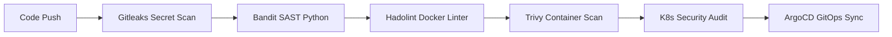

# 🛒 Plateforme E-Commerce CRUD GitOps (ArgoCD, Kubernetes, Ingress SSL & Apache Airflow ETL)

[](#-pipeline-devsecops)
[](#-architecture-kubernetes)
[](#-gitops-avec-argocd)
[](#-pipeline-etl-apache-airflow)
[](#-sécurité-ssl--ingress-nginx)

---

## 📋 Table des Matières
1. [Vue d'ensemble de l'Architecture](#-vue-densemble-de-larchitecture)
2. [Composants du Projet](#-composants-du-projet)
3. [Prérequis & Installation](#-prérequis--installation)
4. [Démarrage Rapide en 1 Commande](#-démarrage-rapide-en-1-commande)
5. [Configuration DNS & Certificat SSL (HTTPS)](#-configuration-dns--certificat-ssl-https)
6. [Gestion GitOps avec ArgoCD & GitHub](#-gestion-gitops-avec-argocd--github)
7. [Pipeline ETL Apache Airflow sur Kubernetes](#-pipeline-etl-apache-airflow-sur-kubernetes)
8. [Pipeline DevSecOps & Scans de Sécurité](#-pipeline-devsecops--scans-de-sécurité)
9. [Commandes Utiles (Makefile)](#-commandes-utiles-makefile)

---

## 🏛️ Vue d'ensemble de l'Architecture

Cette plateforme fournit une stack complète **Cloud-Native / DevSecOps** :
- **Application Web E-Commerce CRUD** : Produits, Paniers, Commandes/Ventes, Clients et Analytics en Python Flask & Bootstrap 5.
- **GitOps Moteur (ArgoCD)** : Synchronisation automatique et réconciliation de l'état Kubernetes depuis le dépôt GitHub.
- **Ingress NGINX & Terminaison SSL** : Accès sécurisé en HTTPS (`https://www.ecommerce.lcl`, `https://argocd.ecommerce.lcl`, `https://airflow.ecommerce.lcl`).
- **ETL Apache Airflow sur K8s** : Extraction des transactions, calcul du Chiffre d'Affaires, panier moyen, alertes de rupture de stock et chargement dans le Datamart.
- **Sécurité DevSecOps** : Hardened Dockerfile non-root, scans SAST (Bandit), secret leak (Gitleaks), Hadolint et scans de vulnérabilités conteneurs (Trivy).

```
                      +-----------------------------+
                      |       Dépôt GitHub          |
                      |  (Code Source & Manifests)  |
                      +--------------+--------------+
                                     |
              +----------------------+----------------------+
              |                                             |
              v (Trigger CI)                                v (GitOps Poll)
      +---------------+                             +---------------+
      | GitHub Actions|                             |    ArgoCD     |
      |   DevSecOps   |                             |  (Namespace   |
      |  (SAST, Trivy)|                             |    argocd)    |
      +---------------+                             +-------+-------+
                                                            | Sync
                                                            v
+-------------------------------------------------------------------------------+
|                           CLUSTER KUBERNETES                                  |
|                                                                               |
|   +-----------------------------------------------------------------------+   |
|   |                       NGINX Ingress Controller                        |   |
|   |         (Certificat SSL TLS Secret : ecommerce-tls-secret)            |   |
|   +-----------+-------------------------------+-----------------------+---+   |
|               |                               |                       |       |
|               v                               v                       v       |
|   [ https://www.ecommerce.lcl ]   [ https://argocd.ecommerce.lcl ]    |       |
|   +---------------------------+   +------------------------------+    |       |
|   | Namespace : ecommerce     |   | Namespace : argocd           |    |       |
|   |  - Web App (CRUD Flask)   |   |  - ArgoCD Server             |    |       |
|   |  - PostgreSQL DB          |   |  - Application Controllers   |    |       |
|   +-------------^-------------+   +------------------------------+    |       |
|                 |                                                     |       |
|                 | Extraction / Mise à jour Datamart                   |       |
|                 +-----------------------------+                       |       |
|                                               |                       |       |
|   [ https://airflow.ecommerce.lcl ] <---------+-----------------------+       |
|   +--------------------------------------------------------------+            |
|   | Namespace : airflow                                          |            |
|   |  - Airflow Webserver & Scheduler                             |            |
|   |  - DAG ETL (ecommerce_sales_etl)                             |            |
|   |  - PostgreSQL Metadata DB                                    |            |
|   +--------------------------------------------------------------+            |
+-------------------------------------------------------------------------------+
```

---

## 📂 Structure du Projet

```
devsecops/
├── .github/
│   └── workflows/
│       └── devsecops-ci.yml        # Pipeline CI/CD GitHub Actions (DevSecOps)
├── src/                            # Code source Application E-Commerce CRUD
│   ├── app/
│   │   ├── app.py                  # Factory Flask, seeding initial et healthchecks
│   │   ├── models.py               # Modèles SQLAlchemy (Produits, Ventes, Clients)
│   │   ├── routes.py               # Routes CRUD et Endpoints REST API
│   │   ├── templates/              # Interface Web Bootstrap 5
│   │   └── static/                 # Styles CSS et Scripts JS
│   ├── Dockerfile                  # Dockerfile durci multi-stage non-root
│   ├── .dockerignore
│   └── requirements.txt
├── airflow/                        # Pipeline ETL Apache Airflow
│   ├── dags/
│   │   └── ecommerce_sales_etl.py  # DAG ETL Ventes -> KPIs -> Datamart
│   └── requirements.txt
├── k8s/                            # Manifestes Kubernetes Déclaratifs (Kustomize)
│   ├── base/
│   │   └── namespaces.yaml         # Namespaces : ecommerce, airflow, argocd
│   ├── apps/
│   │   ├── ecommerce/              # Déploiement App + Postgres BDD + Service
│   │   ├── airflow/                # Déploiement Airflow + Scheduler + Postgres
│   │   └── ingress/                # Ingress NGINX HTTPS avec TLS Secret
│   ├── argocd/                     # Définitions CRD Application ArgoCD
│   └── kustomization.yaml          # Kustomize Root
├── certs/                          # Certificats SSL générés (file.crt, file.key)
├── scripts/                        # Scripts d'automatisation
│   ├── setup-all.sh                # Déploiement complet en 1 clic
│   ├── generate-ssl.sh             # Générateur OpenSSL SAN
│   ├── add-hosts.sh                # Configuration /etc/hosts
│   ├── devsecops-scan.sh           # Audit de sécurité local
│   └── teardown.sh                 # Nettoyage du cluster
├── tests/                          # Tests unitaires et d'intégration
├── Makefile                        # Raccourcis de commandes Make
└── README.md
```

---

## ⚡ Prérequis & Installation

Si rien n'est encore configuré sur votre machine Linux, installez les outils de base :

```bash
# 1. Mise à jour et outils système
sudo apt-get update && sudo apt-get install -y docker.io openssl curl git make

# 2. Donner les droits Docker à l'utilisateur courant
sudo usermod -aG docker $USER && newgrp docker

# 3. Installer Minikube (si non présent)
curl -LO https://storage.googleapis.com/minikube/releases/latest/minikube-linux-amd64
sudo install minikube-linux-amd64 /usr/local/bin/minikube && rm minikube-linux-amd64

# 4. Installer Kubectl (si non présent)
curl -LO "https://dl.k8s.io/release/$(curl -L -s https://dl.k8s.io/release/stable.txt)/bin/linux/amd64/kubectl"
sudo install -o root -g root -m 0755 kubectl /usr/local/bin/kubectl && rm kubectl
```

---

## 🚀 Démarrage Rapide en 1 Commande

Pour lancer automatiquement tout le cluster, les certificats SSL, ArgoCD, Airflow et l'application E-commerce :

```bash
make setup
```
*(ou `./scripts/setup-all.sh`)*

### Que fait ce script automatiquement ?
1. Démarre **Minikube** avec le driver Docker et 4 CPUs / 6 Go RAM.
2. Active les addons **Ingress NGINX** et **Metrics Server**.
3. Génère les certificats SSL/TLS (`file.crt`, `file.key`) avec OpenSSL pour `www.ecommerce.lcl`, `argocd.ecommerce.lcl` et `airflow.ecommerce.lcl`.
4. Crée le secret Kubernetes TLS `ecommerce-tls-secret`.
5. Construit l'image Docker durcie `ecommerce-app:v1.0.0` directement dans Minikube.
6. Installe **ArgoCD** dans le namespace `argocd`.
7. Déploie **PostgreSQL**, **l'application E-commerce**, **Apache Airflow** et les règles **Ingress HTTPS**.
8. Affiche tous les identifiants et URLs de connexion.

---

## 🌐 Configuration DNS & Certificat SSL (HTTPS)

### 1. Ajout dans `/etc/hosts`
Pour que votre navigateur résolve le domaine local `www.ecommerce.lcl` :

```bash
# Obtenir l'IP de Minikube (ou 127.0.0.1)
echo "$(minikube ip) www.ecommerce.lcl ecommerce.lcl argocd.ecommerce.lcl airflow.ecommerce.lcl" | sudo tee -a /etc/hosts
```
*(Vous pouvez aussi exécuter `make hosts`)*

### 2. Routage Ingress sous Linux
Sous Linux avec le driver Docker Minikube, ouvrez un terminal séparé pour activer le routage Ingress :
```bash
minikube tunnel
```

### 3. Accès aux Services dans votre Navigateur :
| Service | URL Sécurisée | Identifiants par défaut |
| :--- | :--- | :--- |
| 🛒 **Site E-Commerce CRUD** | [https://www.ecommerce.lcl](https://www.ecommerce.lcl) | Accès libre |
| 🐙 **Console ArgoCD GitOps** | [https://argocd.ecommerce.lcl](https://argocd.ecommerce.lcl) | `admin` / (mot de passe affiché par `setup-all.sh`) |
| ⚙️ **Apache Airflow ETL** | [https://airflow.ecommerce.lcl](https://airflow.ecommerce.lcl) | `admin` / `admin_airflow_2026` |

---

## 🐙 Gestion GitOps avec ArgoCD & GitHub

### 1. Connecter votre Dépôt GitHub
1. Créez un nouveau dépôt sur votre compte GitHub (ex: `devsecops-ecommerce`).
2. Poussez ce projet sur GitHub :
   ```bash
   git init
   git add .
   git commit -m "feat: initial commit ecommerce gitops platform"
   git branch -M main
   git remote add origin https://github.com/<VOTRE_USER_OU_ORG>/devsecops-ecommerce.git
   git push -u origin main
   ```
3. Modifiez l'URL du repo dans les fichiers `k8s/argocd/app-*.yaml` pour pointer vers votre GitHub :
   ```yaml
   source:
     repoURL: 'https://github.com/<VOTRE_USER_OU_ORG>/devsecops-ecommerce.git'
     targetRevision: HEAD
     path: k8s/apps/ecommerce
   ```
4. Appliquez les applications dans ArgoCD :
   ```bash
   kubectl apply -f k8s/argocd/app-ecommerce.yaml
   kubectl apply -f k8s/argocd/app-airflow.yaml
   kubectl apply -f k8s/argocd/app-ingress.yaml
   ```

ArgoCD synchronisera en continu l'état du cluster Kubernetes avec votre dépôt Git !

---

## ⚙️ Pipeline ETL Apache Airflow sur Kubernetes

Le DAG `ecommerce_sales_etl` s'exécute automatiquement toutes les heures (ou sur déclenchement manuel) :

1. **Extract** (`extract_ecommerce_data`) : Interroge l'API interne `http://ecommerce-service.ecommerce.svc.cluster.local:5000/api` pour récupérer les commandes et les stocks.
2. **Transform** (`transform_sales_metrics`) : Calcule le chiffre d'affaires, le panier moyen, la catégorie la plus vendue et repère les produits dont le stock est $\le 5$.
3. **Data Quality / DevSecOps** (`validate_data_quality`) : Vérifie l'intégrité mathématique des données (non-négativité, cohérence).
4. **Load** (`load_to_datamart_and_export`) : Met à jour la table d'analyse dans la base de données via l'API.

Les résultats sont visibles directement sur l'interface Web E-commerce dans l'onglet **Analytics (Airflow ETL)** !

---

## 🛡️ Pipeline DevSecOps & Scans de Sécurité

La chaîne DevSecOps intégrée applique le principe du **Shift-Left Security** :



### Lancer un scan de sécurité en local :
```bash
make scan
```
*(ou `./scripts/devsecops-scan.sh`)*

Outils intégrés :
- **Gitleaks** : Détection des clés d'API et secrets accidentels dans les commits.
- **Bandit** : Analyse de sécurité statique du code Python (injections, faiblesses cryptographiques).
- **Hadolint** : Respect des bonnes pratiques et durcissement du Dockerfile.
- **Trivy** : Détection des vulnérabilités CVE dans les packages OS et dépendances conteneurisées.

---

## 🛠️ Commandes Utiles (Makefile)

| Commande | Description |
| :--- | :--- |
| `make setup` | Déploie automatiquement tout l'environnement Minikube, SSL, ArgoCD, Airflow |
| `make ssl` | Régénère les certificats SSL auto-signés (`file.crt`, `file.key`) |
| `make hosts` | Vérifie et affiche la configuration pour `/etc/hosts` |
| `make build` | Construit l'image Docker locale durcie |
| `make test` | Exécute la suite de tests unitaires et d'intégration |
| `make scan` | Lance la suite complète de scans de sécurité DevSecOps |
| `make deploy` | Applique les manifestes Kubernetes Kustomize (`kubectl apply -k k8s/`) |
| `make tunnel` | Lance le tunnel réseau Minikube pour l'Ingress sous Linux |
| `make logs` | Suit les logs en temps réel de l'application E-commerce |
| `make logs-airflow` | Suit les logs d'Apache Airflow |
| `make clean` | Supprime les ressources Kubernetes et arrête Minikube |

---

Développé pour l'architecture de référence **GitOps & DevSecOps Cloud-Native 2026**.

